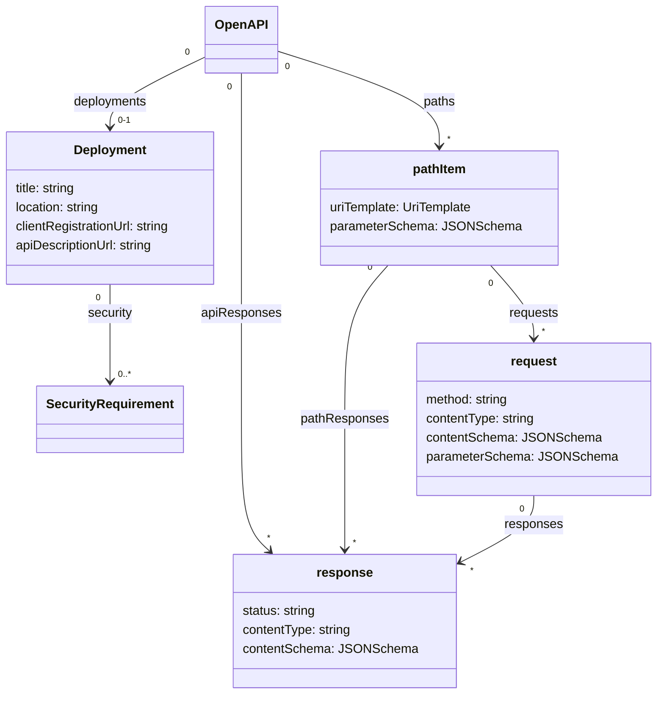

# Moonwalk Document refactoring

The initial moonwalk proposal was primarily focused on how to describe the paths, requests, and responses of an API. Further discussions around the growing needs of the API community have identified additional opportunities for improvement by refactoring the structure of the OpenAPI document and the elements it contains. The first use case concerns improving lifecycle support as an API evolves.

## Requirements:

- Decouple operations and schemas from the contexts (such as server or authentication) that are necessary to invoke those operations.
- As an API changes over time, advertise a list of deployments that share a relationship to that API
- Allow each deployment to independently refer to a different revisions of the description of that API as appropriate
- Naturally support the existing use cases of OpenAPI, while also preserving the option to use other formats

## Current situation

The description of an API contained in an OpenAPI document may actually be addressable at multiple locations (deployments), or it may not be implemented by any. In the case of industry standards bodies defining API shapes, the API may be implemented by completely different organizations than those describing the API shape.

OpenAPI v3 does not make a clear delineation between the shape of the API and certain implementation details of the API by intention. 

## Proposal

For moonwalk this proposal suggests that we create a new object called `deployment` that captures the deployment details of a specific instance of an API along with certain implementation characteristics. The `deployment` object provides the context necessary to call API operations without providing any details about the shape of the API itself.



In order to support a single-file expression, an OpenAPI document may contain zero or multiple Deployment objects that share the otherwise identical description contained within said OpenAPI document.

```yaml
OpenApi: 4.0.0
deployments:
    - title: "prod - ca"
      location: https://api.example.ca
      security:
          - basic: []
      clientRegistrationUrl: "https://developers.example.com/catalog/accounts" # optional, identifies where credentials may be obtained
      apiDescriptionUrl: "https://developers.example.com/catalog/accounts/openapi.2.0.2.yaml"

paths:
    /hello:
        requests:
          basic:
            method: GET
            responses:
              success:
                status: '200'
                contentType: application/json
                contentSchema: HelloResponse
              fail:
                status: '5XX'
                contentType: application/json
                contentSchema: Error
components:
    schemas:
        Error:
            type: object
            properties:
                code:
                    type: integer
                    format: int32
                message:
                    type: string
        HelloResponse:
            type: object
            properties:
                message:
                    type: string
```

However, an OpenAPI document may also contain **only** Deployment entries, and each Deployment object can contain a pointer to a distinct API description document. 

```yaml
openapi: 4.0.0
deployments:
    - title: "perf"
      location: https://perf.api.example.com
      security:
          - basic: []
      clientRegistrationUrl: ""
      apiDescriptionUrl: "https://github.com/example-co/apis/blob/9182274701c279aedc4107fedf630639d7d70bbb/accounts/openapi.2.0.4.yaml"
    - title: "prod - ca"
      location: https://api.example.ca
      security:
          - basic: []
      clientRegistrationUrl: "https://developers.example.com/catalog/accounts"
      apiDescriptionUrl: "https://developers.example.com/catalog/accounts/openapi.2.0.2.yaml"
    - title: "prod - us"
      location: https://api.example.us
      security:
          - basic: []
      clientRegistrationUrl: "https://developers.example.com/catalog/accounts"
      apiDescriptionUrl: "https://developers.example.com/catalog/accounts/openapi.2.0.2.yaml"
```
