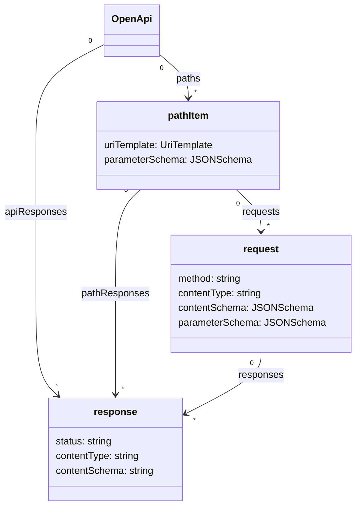

# OpenAPI v4 (aka Moonwalk) Proposal

> note: Warning, disclaimer, caveat.  This is very early thinking and is subject to major change and potential abandonment.  However, intial reactions to the direction have been positive and so ready for input from a wider group of people.

## Introduction
This refresh of OpenAPI attempts to walk a fine line of being simpler while at the same time being more flexible. It attempts to lean more on existing standards and to minimize adding new functionality.  The essence of the restructured model is captured in this diagram.




## Goals
The primary goal of this proposal for a major new version of OpenAPI is to make it more approachable in order. One way it does so is by eliminating complexity that exists in OpenAPI v3. In addition, it aims to:

- Support APIs that have different responses based on query parameters, headers and request bodies.
- Support a broader range of URL design patterns
- Reduce nested structures to improve readability and editability
- Improve reusability of request and response patterns

OpenAPI has become the defacto standard for API descriptions, and it benefits from a very wide range of tooling support. However, due to its historic opinions of how an HTTP API should be designed, there are some scenarios that v3 cannot support. On the one hand, some in the community are asking for increased descriptiveness to support more scenarios. Yet at the same time, other bemoan how OpenAPI has become too complex for hand authoring.

This major update to the OpenAPI specification attempts to simplify the design by focusing on three main structural components: `pathItem`, `request`, and `response`. In OpenAPI v3, a `pathItem` had a set of operations, one for each HTTP method it supported. There was an implicit assumption in this design that a HTTP method on a path could only describe single interaction, with same set of responses. Moonwalk, by contrast, has minimal constraints on how many different types of requests could be performed on a single path. Almost, any part of the request can be used to signal that there may be a unique set of responses.

In OpenAPI v3, the key for a `PathItem` object was limited to just the path portion of a URL. Moonwalk proposes that `pathItem` keys can be complete [URI Templates][uri-templates-rfc]. This allows query parameters to be used in the identification of a resource and its corresponding requests, and it removes the need for parameter definitions to contain serialization information as the URI Template can fully describe how URI template parameters should be serialized. This use of an internet standard will reduce the work required by tooling to support URL construction. This may address the long standing issue of unambiguously correlating URLs with the appropriate `pathItem`.

[uri-templates-rfc]: https://www.rfc-editor.org/rfc/rfc6570

## Requests

`request` objects flatten `operation` objects, `requestBody` objects, and `mediaType` objects into a single object. Deep nesting can become unnecessarily cumbersome for reading and writing OpenAPI descriptions. A `pathItem` object can have multiple request objects. Each request object is named and must have a method specified. It may have a `contentType`, `contentSchema`, and `parameterSchema` defined. This new model allows different responses to be described for different request body media types. However, it does make it more cumbersome for accepting two equivalent media types like `text/json` and `application/json`.

By naming the `request` objects we can give the reader a friendly name to understand the purpose of the `request`. This is especially helpful when there are potentially multiple `request` objects that use the same method. 

Some tooling will need to be able to correlate an actual HTTP request with the corresponding OpenAPI description. This request selection process starts with matching on HTTP method and if present the request's `Content-Type`. If further selection is required, the `parameterSchema` JSON Schema of each `request` object can be used to match with a JSON representation of the HTTP request parameters, headers and request body.

## Responses
Responses also have a friendly name. `response` objects remove the need for the nesting of media-type objects by allowing multiple responses with the same status code but with different content types. `response` objects can be defined at the request level, the path, or globally. This reduces duplicatation of responses that are consistent across the API or for all requests associated to path.

A side effect of giving names to requests and responses is that it makes the predictions from AIs like GitHub Copilot significantly more effective. It also makes folded content more readable in editors in both YAML and JSON because there is a readable name with the details hidden. 

## Simple Example

```yaml
openapi: 4.0.0
info:
  title: Simplest thing that works
  version: 0.5.0
paths:
  "speakers":
    requests:
      createSpeaker:
        method: post
        contentType: application/json
        contentSchema:
          $ref: "#/components/schemas/speaker"
        responses:
          created:
            status: 201
      getSpeakers:
        method: get
        responses:
          ok:
            status: 200
            contentType: application/json
            contentSchema:
              type: array
              items:
                $ref: "#/components/schemas/speaker"
    pathResponses:
      notFound:
        status: 404
        contentType: application/http-problem
apiResponses:
  serverError:
    status: 5XX
    contentType: application/http-problem
components:
  schemas:
    Speaker:
      type: object
      properties:
        name: 
          type: string
```
As compared to 3.1.0

```yaml
openapi: 3.1.0
info:
  title: Simplest thing that works
  version: 0.5.0
paths:
  "/speakers":
    post:
      requestBody:
        content:
          application/json:
            schema:
              $ref: "#/components/schemas/speaker"
      responses:
        201:
          description: created
        404:
          description: notFound
          content:
            application/http-problem: {}
        5XX:
          description: serverError
          content:
            application/http-problem: {}

    get:
      responses:
        201:
          description: created
        200:
          description: retreived
          content:
            application/json:
              schema:
                type: array
                items:
                  $ref: "#/components/schemas/speaker"
        404:
          description: notFound
          content:
            application/http-problem: {}
        5XX:
          description: serverError
          content:
            application/http-problem: {}
components:
  schemas:
    Speaker:
      type: object
      properties:
        name: 
          type: string
```
In this simple example, the moonwalk version has 20% less lines and one less level of indentation.

## JSONSchema for Parameters
By using a JSON Schema object to describe input parameters we can futher disambiguate between the different kinds of requests supported by a path. This enables supporting a whole class of feature requests where API designers want to differentiate operations by [query parameter](examples/parameterSchema.yaml), [header](examples/rpc.yaml) or even [request body](examples/rpc.yaml) content. We can use `allOf` rules to combine parameters defined at the path level and at the request level. We can also have [interdependency rules](examples/dependentParameters.yaml) between parameters. For runtime validation of requests, once filtered by method and contentType, further disambiguation can be done by creating a `oneOf` of the `parameterSchema` for each ambiguous request that is `allOf`'d with the `pathItem`'s `parameterSchema`.

## UriTemplates
By using full URI Templates to define the `pathItem` we can now use query parameters to distinguish between resources and the serialization rules of parameters no longer need to be encoded in the parameter object. OpenAPI v3 enhanced parameter objects to use the serialization features of a `uriTemplate` but without using the syntax. With this change, we can get full access to the `uriTemplate` features and use the standard syntax.

Using full `uriTemplate` syntax allows us to support optional path parameters and multi-segment path parameters. We still need to address the issue of URL to `uriTemplate` mapping where there is ambiguity.

## Components
`request`, `response`, and `schema` objects may be declared as reusable components. This allows `parameterSchema` to either reuse entire schemas of parameter descriptions or use `allOf` to reuse sets of parameters. As the OpenAPI reference object is now independent to the JSON Schema `$ref`, we are free to support OpenAPI Reference arrays as well as reference objects. This will allow reusing a set of requests or a set of responses.

## Examples

- [PetStore Example](examples/petstore.yaml)
- [Parameter Schemas](examples/parameterSchema.yaml)
- [Aggregated API](examples/aggregatedapi.yaml)
- [Dependent Parameters](examples/dependentParameters.yaml)
- [rpc](examples/rpc.yaml)
