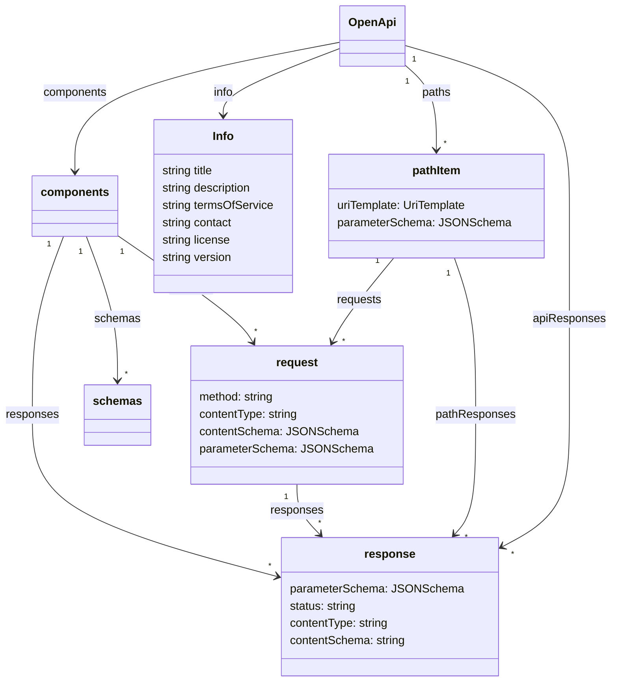

# Moonwalk

## Introduction
This new design for OpenAPI attempts to do walk a fine line of being simpler and at the same time being more flexible and it does this by relying more heavily on existing standards to provide additional functionality without introducing new functionality of its own.



## Requests
Request objects flatten Operation objects, RequestBody Objects and MediaType objects. Deep nesting can become unnecessarily cumbersome.  A PathItem object can have multiple request objects. Each request object is named and must have a method specified.  It may have a contentType, contentSchema and parameterSchema defined. This new model allows different responses to be described for different request body media types.  However, it does make it more cumbersome for accepting two equivalent media types like text/json and application/json.

By naming the requests we can give the reader a friendly name to understand the purpose of the request.  This is especially helpful when there are potentially multiple requests that use the same method.  

## Responses
Responses also have a friendly name.  Response objects remove the need for the nesting of media type objects by allowing multiple responses with the same status code but with different content types.  Responses can be defined at the request level, the path, or globally.

A side effect of giving names to requests and responses is that it makes the predictions of Co-pilot AI significantly more effective.  

## Simple Example

```yaml
openapi: 4.0.0
info:
  title: Simplest thing that works
  version: 0.5.0
paths:
  "/speakers":
    requests:
      createSpeaker:
        method: post
        contentType: application/json
        contentSchema:
          $ref: "#/components/schemas/speaker"
        responses:
          created:
            status: 201
      getSpeakers:
        method: get
        responses:
          ok:
            status: 200
            contentType: application/json
            contentSchema:
              type: array
              items:
                $ref: "#/components/schemas/speaker"
    pathResponses:
      notFound:
        status: 404
        contentType: application/http-problem
apiResponses:
  serverError:
    status: 5XX
    contentType: application/http-problem        
components:
  schemas:
    Speaker:
      type: object
      properties:
        name: 
          type: string
```
As compared to 3.1.0

```yaml
openapi: 3.1.0
info:
  title: Simplest thing that works
  version: 0.5.0
paths:
  "/speakers":
    post:
      requestBody:
        content:
          application/json:
            schema:
              $ref: "#/components/schemas/speaker"
      responses:
        201:
          description: created
        5XX:
          description: serverError
    get:
      responses:
        201:
          description: created
        200:
          description: retreived
          content:
            application/json:
              schema:
                type: array
                items:
                  $ref: "#/components/schemas/speaker"
components:
  schemas:
    Speaker:
      type: object
      properties:
        name: 
          type: string
```


## UriTemplates
By using full URI Templates to define the pathItem we can now use query parameters to distinguish between resources and the serialization rules of parameters no longer need to be encoded in the parameter object. OpenAPI v3 enhanced parameter objects to use the serialization features of UriTemplates but without using the syntax. With this change we can get full access to the UriTemplate features and use the standard syntax.
Using full UriTemplate syntax allows us to support optional path parameters and multi-segment path parameters.  We still need to address the issue of URL to UriTemplate mapping where there is ambiguity.

## JSONSchema for Parameters
By using a JSON Schema object to define the shape of input path and header parameters we can use the allOf rules to combine parameters defined at the path level and at the request level.  We can also have interdependency rules between parameters.  For runtime validation of requests, once filtered by method and contentType, further disabiguation can be done by creating a oneOf of the parameterSchema for each ambiguous request that is allOf'd with the pathItem parameterSchema.

## Examples

- [Aggregated API](aggregatedapi.yaml)
- [Dependent Parameters](dependentParameters.yaml)
- [Parameter Schemas](parameterSchema.yaml)
- [PetStore Example](petstore.yaml)