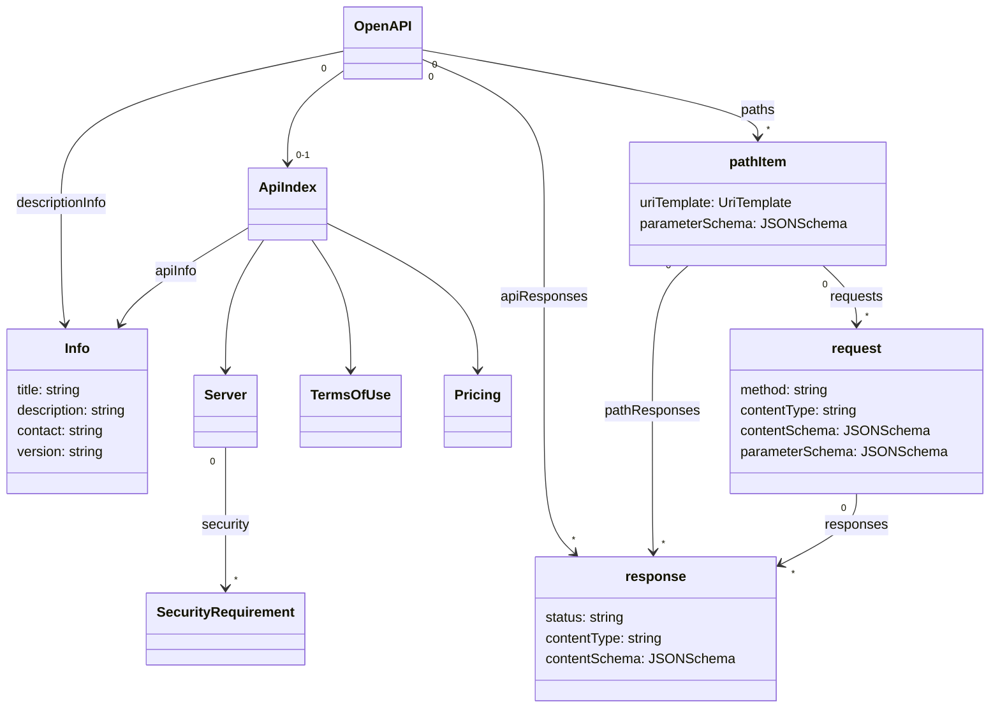

# Moonwalk Document refactoring

The initial moonwalk proposal was primarily focused on how to describe the paths, requests and responses of an API.  Further discussions around the growing needs of the API community have identified additional opportunities for improvement by refactoring the structure of the OpenAPI document and the elements it contains.

## Requirements:

- Advertise a list of available API endpoints
- Enable those API endpoints to either reuse descriptions or use different API descriptions (potentionally with different description formats)
- Naturally support the existing use cases of OpenAPI


The description of an API contained in an OpenAPI document may actually be implemented by multiple APIs.  Or it may not be implemented by any. In the case of industry standards bodies defining API shapes, the API may be implemented by completely different organizations than those describing the API shape.

OpenAPI v3 does not make a clear delineation between the shape of the API and certain implementation details of the API. For moonwalk this proposal suggest that we create a new object called `apiIndex` that captures the details of a specific deployment or instance of an API along with certain implementation characteristics.



A single OpenAPI document may contain zero or multiple  ApiIndex objects for the description contained within the OpenAPI document.

```yaml
OpenApi: 4.0.0
apiIndex:
    - apiInfo:
        title: "Production Hello API"
        version: 1.0
      server: http://localhost:8080
      pricing: {}
      termsOfUse: {}
      support: {}
      security:
          - basic: []
      clientRegistrationUrl: ""
descriptionInfo:
  title: ""
paths:
    /hello:
        requests:
          basic:
            method: GET
            responses:
              success:
                status: '200'
                contentType: application/json
                contentSchema: HelloResponse
              fail:
                status: '5XX'
                contentType: application/json
                contentSchema: Error
components:
    schemas:
        Error:
            type: object
            properties:
                code:
                    type: integer
                    format: int32
                message:
                    type: string
        HelloResponse:
            type: object
            properties:
                message:
                    type: string
```

However, an OpenAPI document may also contain only ApiIndex entries and each ApiIndex object can contain a pointer to an external API Description.  This enables OpenAPI document files to fullfil the role of an API catalog.

```yaml
openapi: 4.0.0
apiIndex:
    - apiInfo:
        title: "API A"
        version: 1.0
      server: http://localhost:8080/A
      pricing: {}
      termsOfUse: {}
      support: {}
      security:
          - basic: []
      clientRegistrationUrl: ""
      apiDescriptionUrl: http://localhost:8080/A/openapi.json
    - apiInfo:
        title: "API B"
        version: 1.0
      server: http://localhost:8080/B
      pricing: {}
      termsOfUse: {}
      support: {}
      security:
          - basic: []
      clientRegistrationUrl: ""
      apiDescriptionUrl: http://localhost:8080/B/openapi.json
```